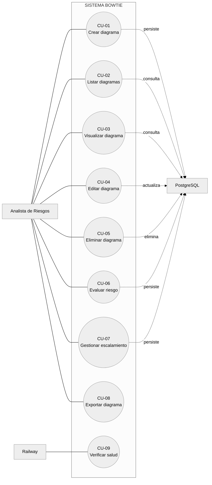

# 4. Casos de Uso y Especificaciones

## 4.1 Actores

| Actor | Descripción |
|-------|-------------|
| **Analista de Riesgos** | Usuario principal que crea, edita, visualiza y evalúa diagramas Bowtie. |
| **Sistema PostgreSQL** | Actor secundario responsable de la persistencia de la información. |
| **Plataforma Railway** | Actor secundario que ejecuta el servicio y monitorea su salud. |

## 4.2 Diagrama de Casos de Uso

## 4.3 Especificaciones de los Casos de Uso

> Cada especificación sigue el formato extendido de Cockburn con
> precondiciones, flujo principal, flujos alternos y post-condiciones.

---

### CU-01 Crear Diagrama Bowtie

| Campo | Descripción |
|-------|-------------|
| **Identificador** | CU-01 |
| **Nombre** | Crear Diagrama Bowtie |
| **Actor primario** | Analista de Riesgos |
| **Actor secundario** | PostgreSQL |
| **Precondición** | El servicio está disponible y la base de datos accesible. |
| **Postcondición** | Un nuevo diagrama queda persistido con sus causas, controles, consecuencias y mitigaciones. |
| **Disparador** | El usuario selecciona la opción “Nuevo diagrama” en el panel principal. |

**Flujo principal**

1. El sistema muestra el asistente con el paso 1 *(Evento)*.
2. El usuario ingresa título, nombre del riesgo, evento tope y descripción.
3. El sistema valida los campos obligatorios y permite avanzar al paso 2.
4. El usuario registra una o varias causas y avanza al paso 3.
5. El usuario asocia controles preventivos por cada causa y avanza al paso 4.
6. El usuario registra las consecuencias y avanza al paso 5.
7. El usuario asocia medidas de mitigación por cada consecuencia.
8. El usuario presiona “Guardar diagrama”.
9. El sistema envía la solicitud `POST /api/diagrams` y persiste todos los datos en una transacción.
10. El sistema confirma la creación y redirige al panel principal.

**Flujos alternos**

- **3a.** Si los campos obligatorios están vacíos, el sistema muestra un mensaje de validación y no avanza.
- **9a.** Si la transacción falla, el sistema revierte la operación y muestra un error genérico al usuario.

---

### CU-02 Listar Diagramas

| Campo | Descripción |
|-------|-------------|
| **Identificador** | CU-02 |
| **Nombre** | Listar Diagramas |
| **Actor primario** | Analista de Riesgos |
| **Precondición** | El servicio está disponible. |
| **Postcondición** | Se presenta al usuario un listado de diagramas con metadata. |

**Flujo principal**

1. El usuario accede al panel principal `/`.
2. El sistema invoca `GET /api/diagrams`.
3. El sistema retorna el listado ordenado por fecha de actualización descendente.
4. El usuario puede filtrar el listado mediante el campo de búsqueda.

---

### CU-03 Visualizar Diagrama

| Campo | Descripción |
|-------|-------------|
| **Identificador** | CU-03 |
| **Nombre** | Visualizar Diagrama Bowtie |
| **Actor primario** | Analista de Riesgos |
| **Precondición** | Existe al menos un diagrama persistido. |
| **Postcondición** | El diagrama es renderizado en pantalla. |

**Flujo principal**

1. El usuario selecciona un diagrama del listado.
2. El sistema invoca `GET /api/diagrams/:id`.
3. El servidor entrega el diagrama con causas, controles, consecuencias, mitigaciones, escalamientos y evaluaciones.
4. El cliente renderiza la representación gráfica del diagrama Bowtie.

---

### CU-04 Editar Diagrama

| Campo | Descripción |
|-------|-------------|
| **Identificador** | CU-04 |
| **Nombre** | Editar Diagrama |
| **Actor primario** | Analista de Riesgos |
| **Precondición** | El diagrama existe en base de datos. |
| **Postcondición** | El diagrama queda actualizado con los nuevos valores. |

**Flujo principal**

1. El usuario selecciona la acción “Editar” sobre un diagrama existente.
2. El sistema reabre el asistente con los datos pre-cargados.
3. El usuario modifica los datos y confirma el guardado.
4. El sistema invoca `PUT /api/diagrams/:id` y actualiza la información.

---

### CU-05 Eliminar Diagrama

| Campo | Descripción |
|-------|-------------|
| **Identificador** | CU-05 |
| **Nombre** | Eliminar Diagrama |
| **Actor primario** | Analista de Riesgos |
| **Precondición** | El diagrama existe en la base de datos. |
| **Postcondición** | El diagrama y todas sus relaciones quedan eliminados. |

**Flujo principal**

1. El usuario selecciona la acción “Eliminar” sobre un diagrama.
2. El sistema solicita confirmación al usuario.
3. Si el usuario confirma, el sistema invoca `DELETE /api/diagrams/:id`.
4. El servidor elimina el registro en cascada (causas, controles, consecuencias, mitigaciones, evaluaciones).

**Flujo alterno**

- **2a.** Si el usuario cancela la confirmación, no se realiza ninguna acción.

---

### CU-06 Evaluar Riesgo

| Campo | Descripción |
|-------|-------------|
| **Identificador** | CU-06 |
| **Nombre** | Evaluar Riesgo (antes/después) |
| **Actor primario** | Analista de Riesgos |
| **Precondición** | El diagrama existe. |
| **Postcondición** | Se almacena una evaluación con la tolerabilidad calculada. |

**Flujo principal**

1. El usuario abre la sección de evaluación dentro del asistente.
2. Selecciona el tipo (antes / después de controles).
3. Asigna una probabilidad y una gravedad entre 1 y 5.
4. El sistema calcula la tolerabilidad mediante la matriz 5×5.
5. El sistema persiste la evaluación con `POST /api/diagrams/:id/evaluations`.

**Flujo alterno**

- **3a.** Si los rangos son inválidos, el servidor responde 400 y el cliente muestra el error.

---

### CU-07 Gestionar Factores de Escalamiento

| Campo | Descripción |
|-------|-------------|
| **Identificador** | CU-07 |
| **Nombre** | Gestionar Escalamientos |
| **Actor primario** | Analista de Riesgos |
| **Precondición** | Existe un control o mitigación al cual asociar el escalamiento. |
| **Postcondición** | El factor queda persistido o eliminado según la operación. |

**Flujo principal — Crear**

1. El usuario abre el modal de escalamiento sobre un control o mitigación.
2. Ingresa el texto del factor.
3. El sistema invoca `POST /api/diagrams/controls/:controlId/escalations` o `POST /api/diagrams/mitigations/:mitigationId/escalations`.
4. El sistema confirma y refresca la vista.

**Flujo principal — Eliminar**

1. El usuario selecciona la acción de eliminación sobre el factor.
2. El sistema invoca el endpoint `DELETE` correspondiente.

---

### CU-08 Exportar Diagrama

| Campo | Descripción |
|-------|-------------|
| **Identificador** | CU-08 |
| **Nombre** | Exportar Diagrama a PDF / SVG |
| **Actor primario** | Analista de Riesgos |
| **Precondición** | El diagrama está visible en pantalla. |
| **Postcondición** | El navegador descarga el archivo solicitado. |

**Flujo principal**

1. El usuario presiona el botón “Exportar a PDF” o “Exportar a SVG”.
2. El cliente captura el SVG renderizado utilizando la librería `html2canvas` (PDF) o serializa el SVG nativo.
3. El cliente compone el archivo final mediante `jsPDF`.
4. El navegador inicia la descarga.

---

### CU-09 Verificar Salud del Servicio

| Campo | Descripción |
|-------|-------------|
| **Identificador** | CU-09 |
| **Nombre** | Verificar Salud (Health Check) |
| **Actor primario** | Plataforma Railway |
| **Precondición** | El servicio está desplegado. |
| **Postcondición** | Se obtiene una respuesta JSON con estado y marca temporal. |

**Flujo principal**

1. Railway invoca periódicamente `GET /api/health`.
2. El servidor responde con `{ status: "ok", environment, timestamp }`.
3. Railway considera el servicio saludable.
