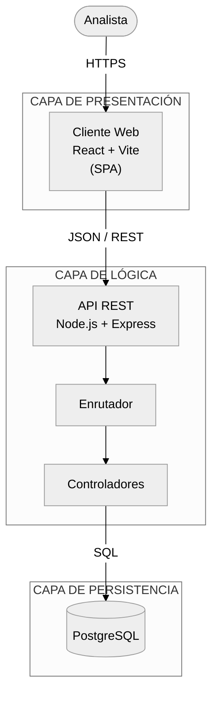
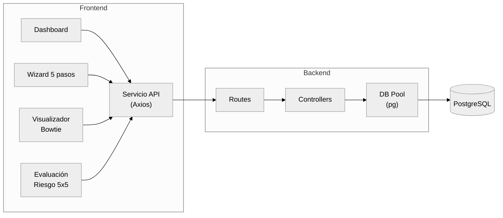
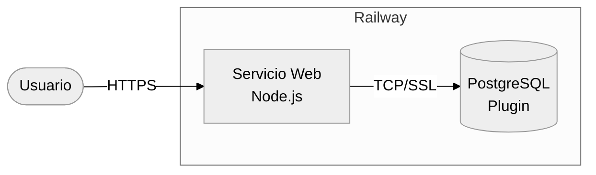

# 5. Arquitectura del Sistema

## 5.1 Visión General

El sistema Bowtie sigue una **arquitectura cliente–servidor de tres capas**
con separación estricta entre la presentación, la lógica de negocio y la
persistencia. El despliegue se realiza como un único servicio web que sirve
tanto los recursos estáticos del cliente como la API REST.

## 5.2 Patrón Arquitectónico

| Elemento | Patrón aplicado |
|----------|-----------------|
| Cliente | *Single Page Application* con enrutado declarativo (React Router). |
| Backend | *Layered Architecture*: rutas → controladores → acceso a datos. |
| API | Estilo **REST** sobre HTTP/JSON. |
| Persistencia | Modelo relacional con integridad referencial. |
| Deploy | Servicio único con build–start estandarizado para Railway. |

## 5.3 Decisiones Arquitectónicas

| Decisión | Justificación |
|----------|--------------|
| Servir el cliente desde el mismo servicio Express | Simplifica el despliegue y elimina problemas de CORS en producción. |
| Usar `DATABASE_URL` opcional | Permite portabilidad entre entornos locales (variables individuales) y Railway/Heroku (cadena de conexión). |
| Separar `routes/` y `controllers/` | Facilita la mantenibilidad y el testing aislado. |
| Cascada de borrado en SQL | Garantiza integridad sin lógica adicional en el servicio. |
| Cálculo de tolerabilidad en el servidor | Centraliza la regla de negocio y evita inconsistencias entre clientes. |
| Frontend con Vite | Tiempos de desarrollo rápidos y bundle eficiente para producción. |

## 5.4 Vista Lógica

## 5.5 Vista de Despliegue (resumen)

El detalle se desarrolla en el documento [11-Diagrama-Despliegue.md](11-Diagrama-Despliegue.md).

## 5.6 Atributos de Calidad

| Atributo | Estrategia |
|----------|------------|
| **Disponibilidad** | Health check `/api/health` y política de reinicio en Railway. |
| **Seguridad** | TLS automático en Railway, validación de entrada en el servidor, separación de credenciales por variables de entorno. |
| **Mantenibilidad** | Capas, módulos por dominio, scripts de migración versionados. |
| **Escalabilidad** | Escalado horizontal posible por la naturaleza *stateless* del servidor. |
| **Portabilidad** | Compatible con cualquier proveedor que soporte Node.js 18+. |
