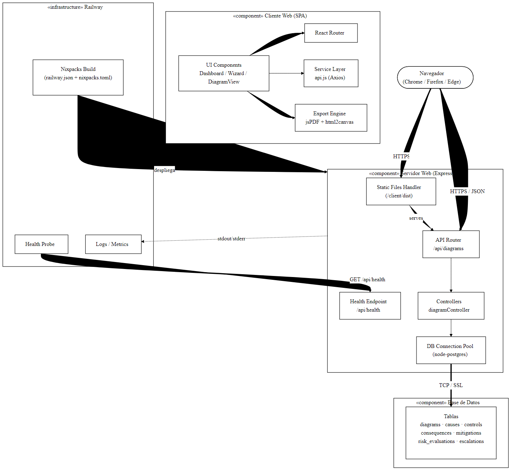
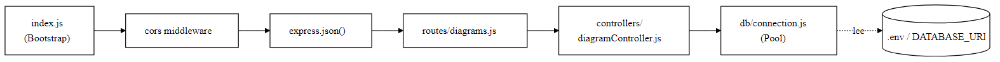

# 6. Diagrama de Componentes

## 6.1 Propósito

El diagrama de componentes muestra los módulos lógicos del sistema, sus
interfaces explícitas y las relaciones de dependencia entre ellos. Es el
artefacto principal que documenta la **estructura física del software**
desplegado en Railway.

## 6.2 Diagrama de Componentes (Despliegue Railway)

> **Diagrama de Componentes — Despliegue Railway** — [descargar PDF](Diagramas/06-01-Componentes-Railway.pdf)

## 6.3 Catálogo de Componentes

| Componente | Tipo | Tecnología | Responsabilidad |
|------------|------|-----------|-----------------|
| **UI Components** | Frontend | React 18 | Renderizar las vistas del dashboard, wizard y visualización del diagrama. |
| **React Router** | Frontend | react-router-dom 6 | Navegación SPA entre vistas. |
| **Service Layer** | Frontend | Axios | Adaptador HTTP que centraliza llamadas a la API. |
| **Export Engine** | Frontend | jsPDF, html2canvas | Generación de PDF y SVG a partir del DOM. |
| **Static Files Handler** | Backend | Express `express.static` | Sirve los recursos del SPA en producción. |
| **API Router** | Backend | Express Router | Define los recursos REST sobre `/api/diagrams`. |
| **Health Endpoint** | Backend | Express | Provee el endpoint `/api/health` para Railway. |
| **Controllers** | Backend | JavaScript ES Modules | Implementa la lógica de negocio y orquesta la base de datos. |
| **DB Connection Pool** | Backend | node-postgres (`pg`) | Pool de conexiones a PostgreSQL con soporte SSL. |
| **PostgreSQL** | Persistencia | PostgreSQL 14+ | Almacenamiento relacional con integridad referencial. |
| **Nixpacks Build** | Infraestructura | Railway / Nixpacks | Construye el artefacto de despliegue. |
| **Health Probe** | Infraestructura | Railway | Verifica la salud del contenedor. |

## 6.4 Interfaces

| Interfaz | Proveedor | Consumidor | Protocolo |
|----------|-----------|------------|-----------|
| **REST `/api/diagrams`** | Backend | Cliente Web | HTTP/JSON |
| **REST `/api/health`** | Backend | Railway | HTTP/JSON |
| **PostgreSQL Wire Protocol** | PostgreSQL | Backend | TCP + SSL |
| **HTTPS estática** | Backend (express.static) | Navegador | HTTP/HTTPS |

## 6.5 Diagrama de Componentes — Vista Detallada del Backend

> **Diagrama de Componentes — Detalle Backend** — [descargar PDF](Diagramas/06-02-Componentes-Backend.pdf)

## 6.6 Empaquetado y Despliegue

| Artefacto | Origen | Destino |
|-----------|--------|---------|
| `client/dist/` | `npm --prefix client run build` | Servido por Express en producción. |
| `server/src/` | Node.js ESM | Ejecutado mediante `npm start`. |
| `database/init.sql` | Repositorio | Ejecutado manualmente al provisionar la BD. |
| `railway.json` | Repositorio | Configuración de build / health / restart. |
| `nixpacks.toml` | Repositorio | Configuración de fases de Nixpacks. |
| `Procfile` | Repositorio | Compatibilidad con buildpacks tipo Heroku. |
