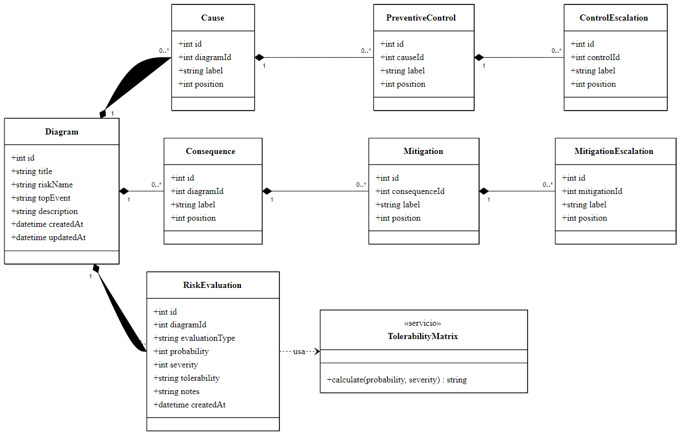
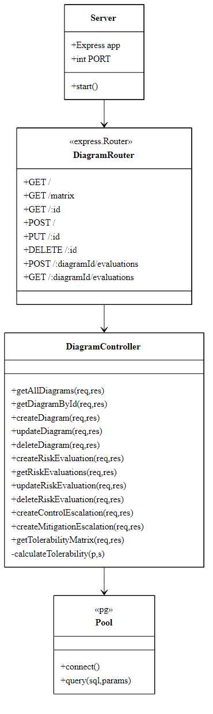
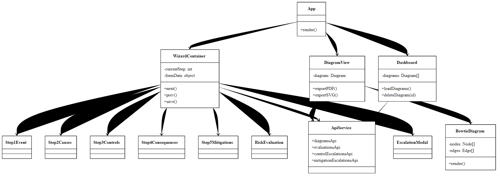

# 7. Diagrama de Clases

## 7.1 Modelo de Dominio

El sistema Bowtie no implementa un ORM, sino que opera directamente sobre
PostgreSQL. Sin embargo, el modelo conceptual se expresa mediante clases
que reflejan las entidades de negocio y sus relaciones.

> **Diagrama de Clases — Modelo de Dominio** — [descargar PDF](Diagramas/07-01-Clases-Dominio.pdf)

## 7.2 Diagrama de Clases del Backend

> **Diagrama de Clases — Backend** — [descargar PDF](Diagramas/07-02-Clases-Backend.pdf)

## 7.3 Diagrama de Clases del Frontend

> **Diagrama de Clases — Frontend** — [descargar PDF](Diagramas/07-03-Clases-Frontend.pdf)

## 7.4 Reglas de Negocio Encapsuladas

| Regla | Implementación |
|-------|---------------|
| Un diagrama puede tener múltiples causas y consecuencias. | Relación `1..*` con cascada de borrado. |
| Cada control preventivo está asociado a una única causa. | Clave foránea `cause_id` con `ON DELETE CASCADE`. |
| Cada mitigación está asociada a una única consecuencia. | Clave foránea `consequence_id` con `ON DELETE CASCADE`. |
| La probabilidad y la gravedad están restringidas al rango 1..5. | Restricción `CHECK` en SQL y validación en el controlador. |
| La tolerabilidad se deriva de probabilidad × gravedad. | Función `calculateTolerability` y matriz constante `TOLERABILITY_MATRIX`. |
| Toda evaluación se clasifica como `before` o `after`. | Validación en el controlador. |
