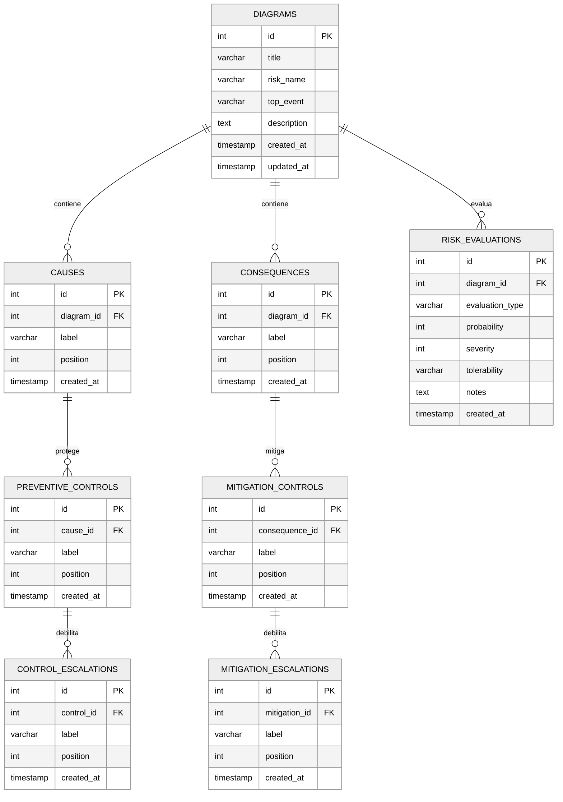

# 8. Modelo de Datos

## 8.1 Diagrama Entidad–Relación

## 8.2 Diccionario de Datos

### 8.2.1 `diagrams`

| Columna | Tipo | Restricciones | Descripción |
|---------|------|---------------|-------------|
| `id` | SERIAL | PK | Identificador único. |
| `title` | VARCHAR(255) | NOT NULL | Título del diagrama. |
| `risk_name` | VARCHAR(255) | NOT NULL | Nombre del riesgo analizado. |
| `top_event` | VARCHAR(500) | NOT NULL | Evento tope. |
| `description` | TEXT | DEFAULT '' | Descripción libre. |
| `created_at` | TIMESTAMP | DEFAULT NOW | Fecha de creación. |
| `updated_at` | TIMESTAMP | DEFAULT NOW | Fecha de última modificación (trigger). |

### 8.2.2 `causes`

| Columna | Tipo | Restricciones | Descripción |
|---------|------|---------------|-------------|
| `id` | SERIAL | PK | Identificador. |
| `diagram_id` | INTEGER | FK → diagrams(id) ON DELETE CASCADE | Diagrama propietario. |
| `label` | VARCHAR(500) | NOT NULL | Texto descriptivo. |
| `position` | INTEGER | DEFAULT 0 | Orden visual. |
| `created_at` | TIMESTAMP | DEFAULT NOW | Fecha de creación. |

### 8.2.3 `preventive_controls`

| Columna | Tipo | Restricciones | Descripción |
|---------|------|---------------|-------------|
| `id` | SERIAL | PK | Identificador. |
| `cause_id` | INTEGER | FK → causes(id) ON DELETE CASCADE | Causa asociada. |
| `label` | VARCHAR(500) | NOT NULL | Nombre del control. |
| `position` | INTEGER | DEFAULT 0 | Orden visual. |
| `created_at` | TIMESTAMP | DEFAULT NOW | Fecha de creación. |

### 8.2.4 `consequences`

| Columna | Tipo | Restricciones | Descripción |
|---------|------|---------------|-------------|
| `id` | SERIAL | PK | Identificador. |
| `diagram_id` | INTEGER | FK → diagrams(id) ON DELETE CASCADE | Diagrama propietario. |
| `label` | VARCHAR(500) | NOT NULL | Texto descriptivo. |
| `position` | INTEGER | DEFAULT 0 | Orden visual. |
| `created_at` | TIMESTAMP | DEFAULT NOW | Fecha de creación. |

### 8.2.5 `mitigation_controls`

| Columna | Tipo | Restricciones | Descripción |
|---------|------|---------------|-------------|
| `id` | SERIAL | PK | Identificador. |
| `consequence_id` | INTEGER | FK → consequences(id) ON DELETE CASCADE | Consecuencia asociada. |
| `label` | VARCHAR(500) | NOT NULL | Texto descriptivo. |
| `position` | INTEGER | DEFAULT 0 | Orden visual. |
| `created_at` | TIMESTAMP | DEFAULT NOW | Fecha de creación. |

### 8.2.6 `risk_evaluations`

| Columna | Tipo | Restricciones | Descripción |
|---------|------|---------------|-------------|
| `id` | SERIAL | PK | Identificador. |
| `diagram_id` | INTEGER | FK → diagrams(id) ON DELETE CASCADE | Diagrama evaluado. |
| `evaluation_type` | VARCHAR(20) | NOT NULL — valores `before`/`after` | Momento de la evaluación. |
| `probability` | INTEGER | CHECK 1..5 | Probabilidad. |
| `severity` | INTEGER | CHECK 1..5 | Gravedad. |
| `tolerability` | VARCHAR(50) | — | Calculado: Aceptable, Tolerable, Intolerable, Inaceptable. |
| `notes` | TEXT | — | Observaciones. |
| `created_at` | TIMESTAMP | DEFAULT NOW | Fecha de creación. |

### 8.2.7 `control_escalations`

| Columna | Tipo | Restricciones | Descripción |
|---------|------|---------------|-------------|
| `id` | SERIAL | PK | Identificador. |
| `control_id` | INTEGER | FK → preventive_controls(id) ON DELETE CASCADE | Control debilitado. |
| `label` | VARCHAR(500) | NOT NULL | Texto del factor de escalamiento. |
| `position` | INTEGER | DEFAULT 0 | Orden visual. |
| `created_at` | TIMESTAMP | DEFAULT NOW | Fecha de creación. |

### 8.2.8 `mitigation_escalations`

| Columna | Tipo | Restricciones | Descripción |
|---------|------|---------------|-------------|
| `id` | SERIAL | PK | Identificador. |
| `mitigation_id` | INTEGER | FK → mitigation_controls(id) ON DELETE CASCADE | Mitigación debilitada. |
| `label` | VARCHAR(500) | NOT NULL | Texto del factor de escalamiento. |
| `position` | INTEGER | DEFAULT 0 | Orden visual. |
| `created_at` | TIMESTAMP | DEFAULT NOW | Fecha de creación. |

## 8.3 Matriz de Tolerabilidad 5×5

| Probabilidad ↓ \\ Gravedad → | 1 — Insignificante | 2 — Menor | 3 — Mayor | 4 — Peligroso | 5 — Catastrófico |
|--------------------------|--------------------|-----------|-----------|----------------|--------------------|
| **5 — Frecuente** | Tolerable | Intolerable | Intolerable | Inaceptable | Inaceptable |
| **4 — Probable** | Aceptable | Tolerable | Intolerable | Intolerable | Inaceptable |
| **3 — Ocasional** | Aceptable | Tolerable | Tolerable | Intolerable | Intolerable |
| **2 — Remoto** | Aceptable | Aceptable | Tolerable | Tolerable | Intolerable |
| **1 — Improbable** | Aceptable | Aceptable | Aceptable | Tolerable | Tolerable |

## 8.4 Índices

| Índice | Tabla | Campo |
|--------|-------|-------|
| `idx_causes_diagram_id` | causes | diagram_id |
| `idx_preventive_controls_cause_id` | preventive_controls | cause_id |
| `idx_consequences_diagram_id` | consequences | diagram_id |
| `idx_mitigation_controls_consequence_id` | mitigation_controls | consequence_id |
| `idx_risk_evaluations_diagram_id` | risk_evaluations | diagram_id |
| `idx_control_escalations_control_id` | control_escalations | control_id |
| `idx_mitigation_escalations_mitigation_id` | mitigation_escalations | mitigation_id |

## 8.5 Triggers

| Trigger | Tabla | Acción |
|---------|-------|--------|
| `update_diagrams_updated_at` | diagrams | Actualiza `updated_at` antes de cada UPDATE. |
