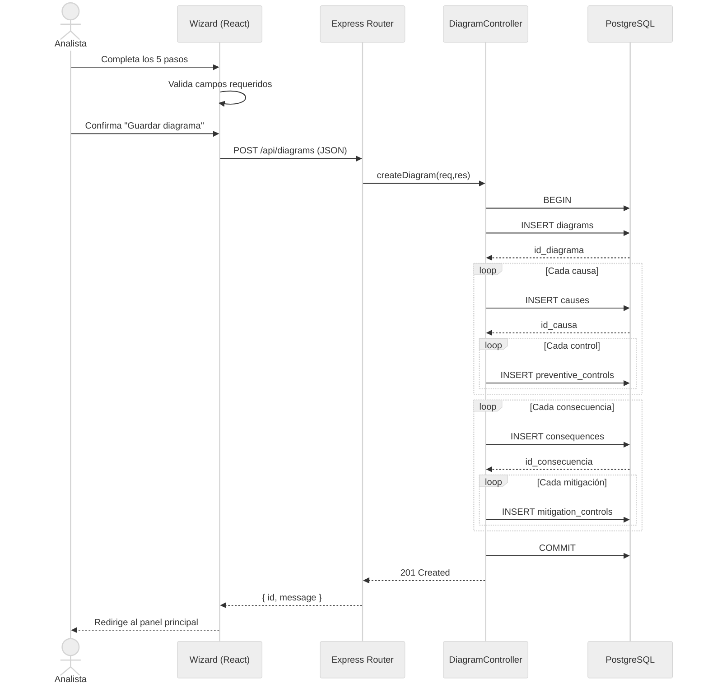
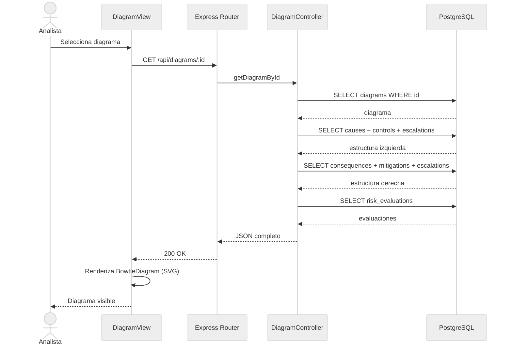
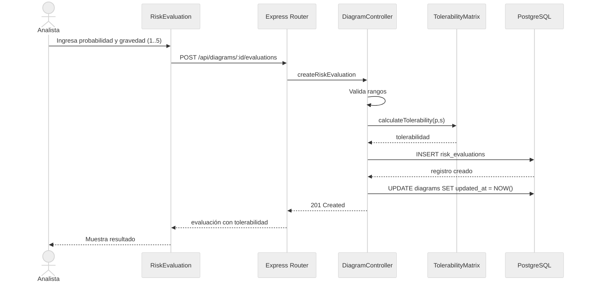
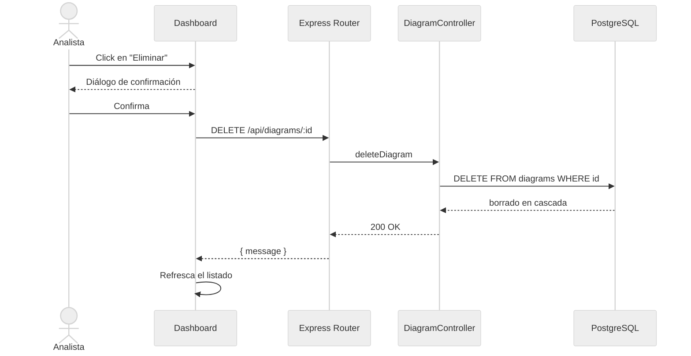
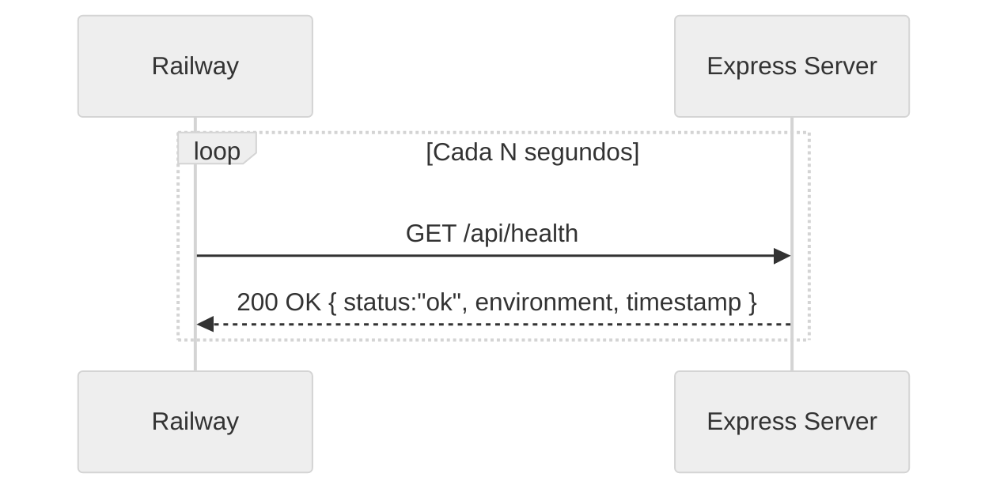

# 9. Diagramas de Secuencia

## 9.1 Crear un Diagrama Bowtie (CU-01)

## 9.2 Visualizar un Diagrama (CU-03)

## 9.3 Evaluar Riesgo (CU-06)

## 9.4 Eliminar Diagrama (CU-05)

## 9.5 Health Check (CU-09)

