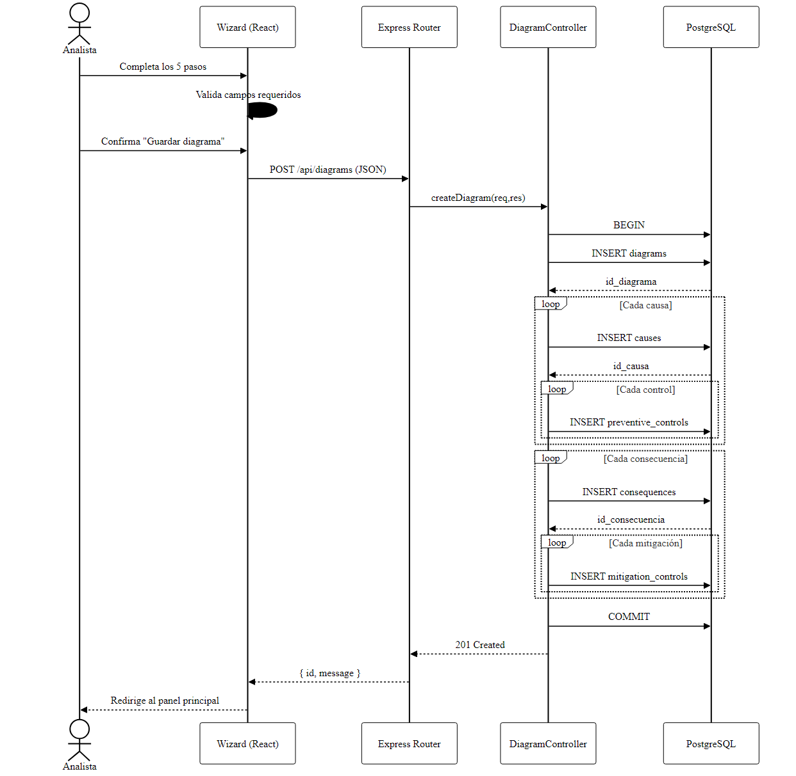
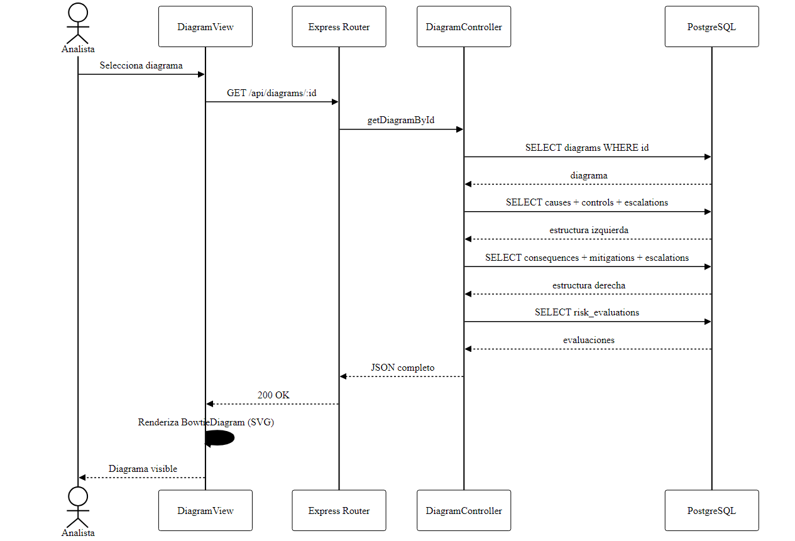
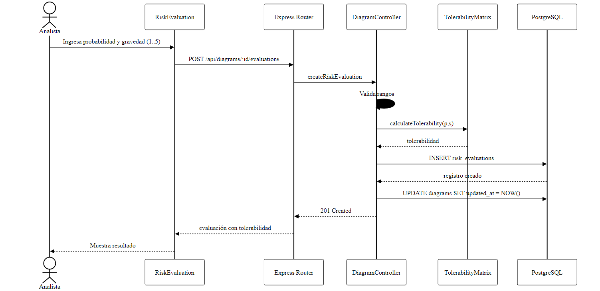
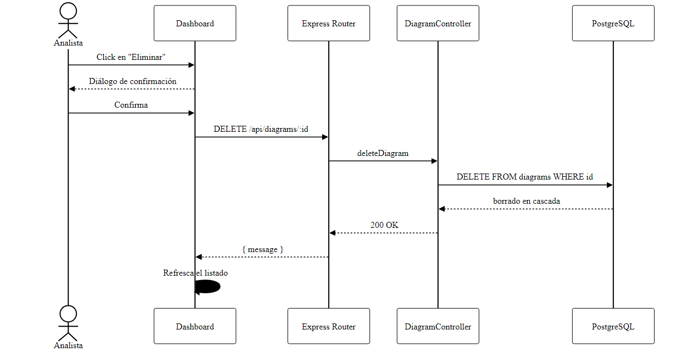
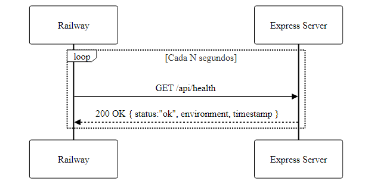

# 9. Diagramas de Secuencia

## 9.1 Crear un Diagrama Bowtie (CU-01)

> **Secuencia — Crear Diagrama (CU-01)** — [descargar PDF](Diagramas/09-01-Secuencia-Crear-Diagrama.pdf)

## 9.2 Visualizar un Diagrama (CU-03)

> **Secuencia — Visualizar Diagrama (CU-03)** — [descargar PDF](Diagramas/09-02-Secuencia-Visualizar.pdf)

## 9.3 Evaluar Riesgo (CU-06)

> **Secuencia — Evaluar Riesgo (CU-06)** — [descargar PDF](Diagramas/09-03-Secuencia-Evaluar-Riesgo.pdf)

## 9.4 Eliminar Diagrama (CU-05)

> **Secuencia — Eliminar Diagrama (CU-05)** — [descargar PDF](Diagramas/09-04-Secuencia-Eliminar.pdf)

## 9.5 Health Check (CU-09)

> **Secuencia — Health Check (CU-09)** — [descargar PDF](Diagramas/09-05-Secuencia-Health-Check.pdf)

