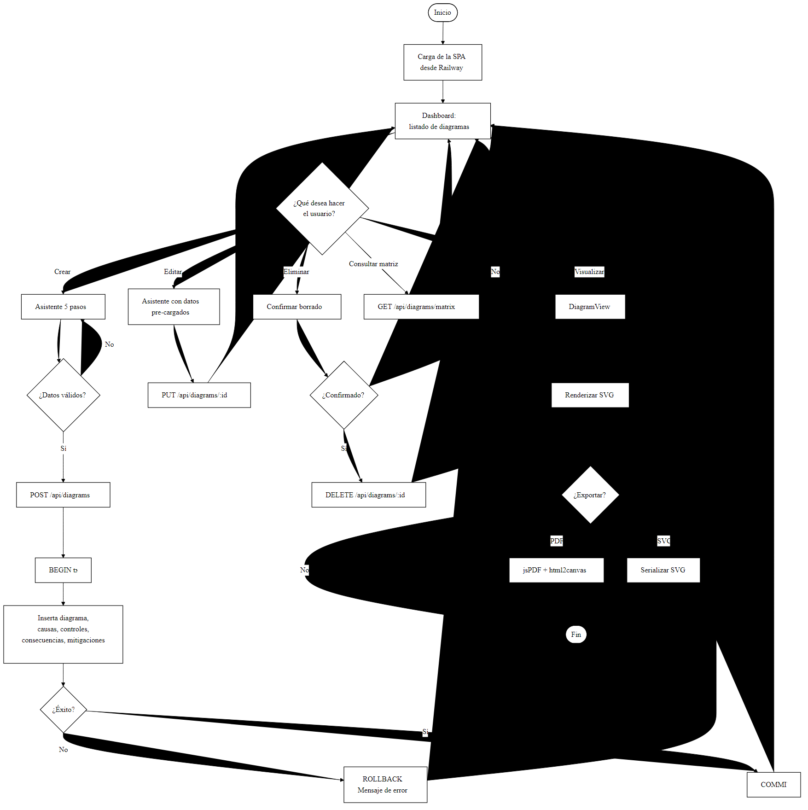
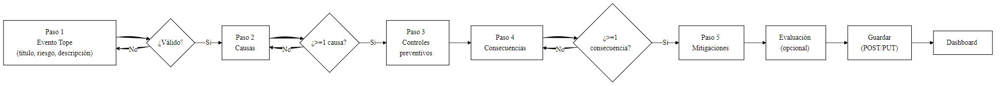
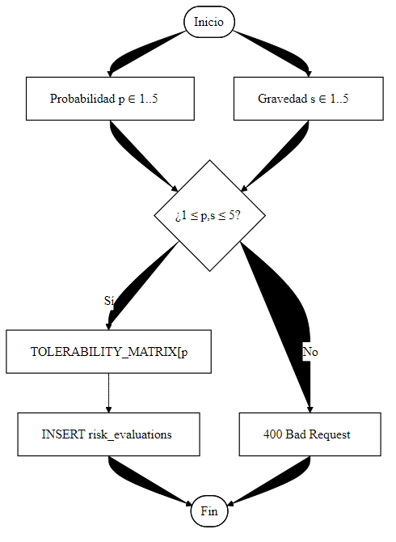
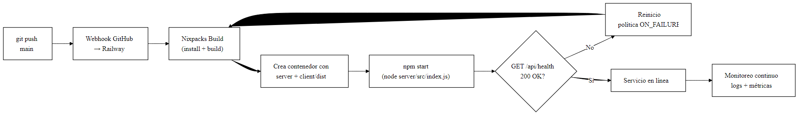
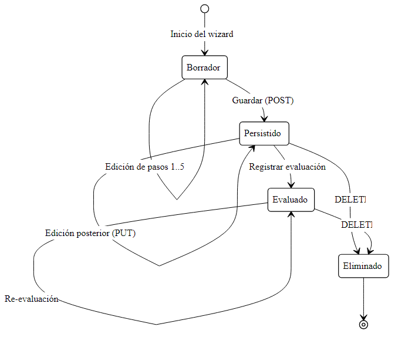

# 10. Diagramas de Actividad y Lógica del Sistema

## 10.1 Diagrama de Lógica General

Este diagrama representa la lógica global del sistema desde el ingreso del
usuario hasta la persistencia de la información.

> **Diagrama de Lógica General del Sistema** — [descargar PDF](Diagramas/10-01-Logica-General.pdf)

## 10.2 Flujo del Asistente de Creación

> **Flujo del Asistente de Creación** — [descargar PDF](Diagramas/10-02-Flujo-Wizard.pdf)

## 10.3 Lógica de la Evaluación de Riesgo

> **Lógica de la Evaluación de Riesgo** — [descargar PDF](Diagramas/10-03-Logica-Evaluacion.pdf)

## 10.4 Flujo de Despliegue en Railway

> **Flujo de Despliegue en Railway** — [descargar PDF](Diagramas/10-04-Flujo-Despliegue-Railway.pdf)

## 10.5 Diagrama de Estados de un Diagrama

> **Diagrama de Estados de un Diagrama** — [descargar PDF](Diagramas/10-05-Estados-Diagrama.pdf)

