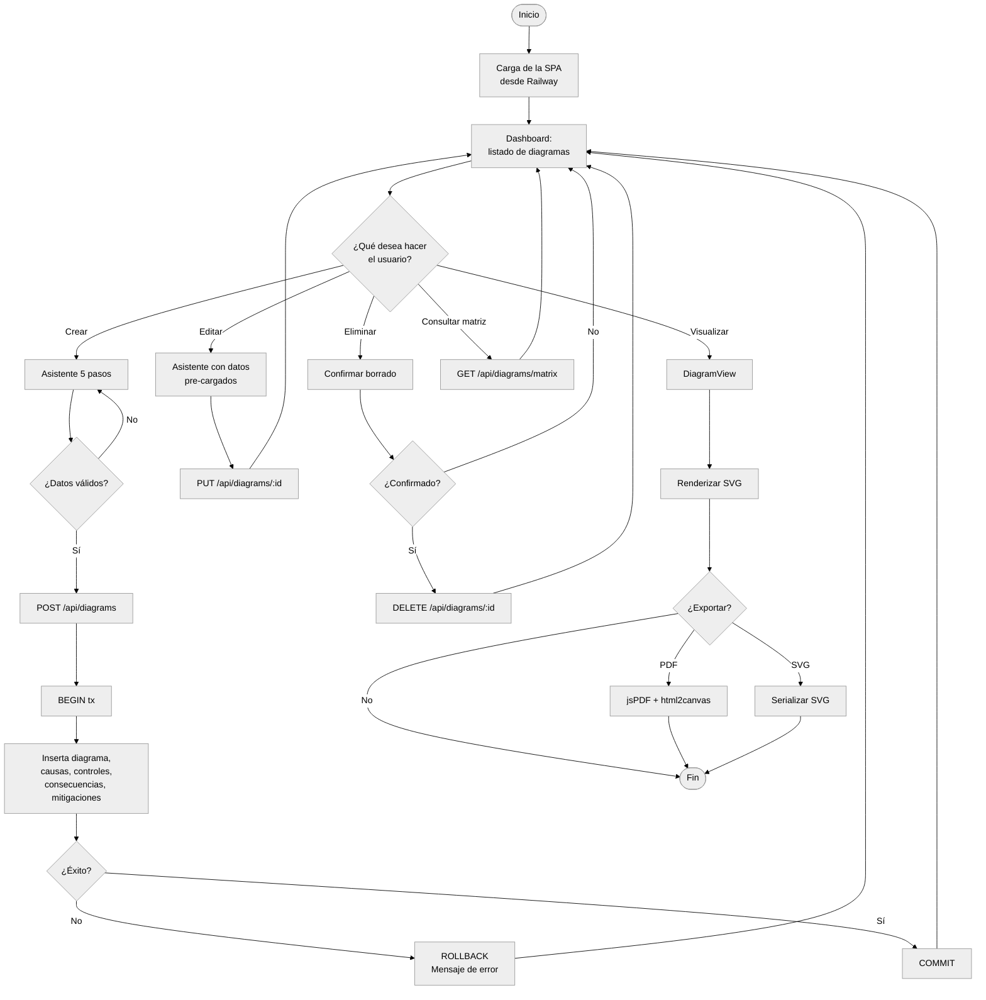
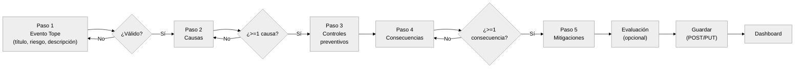
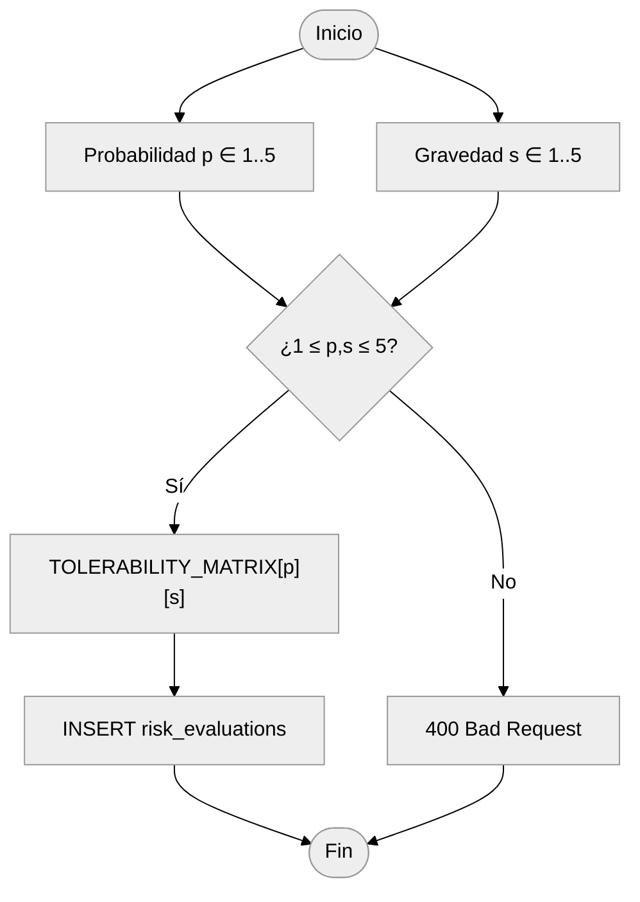
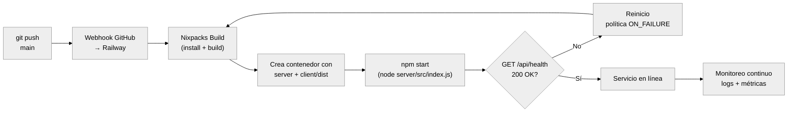
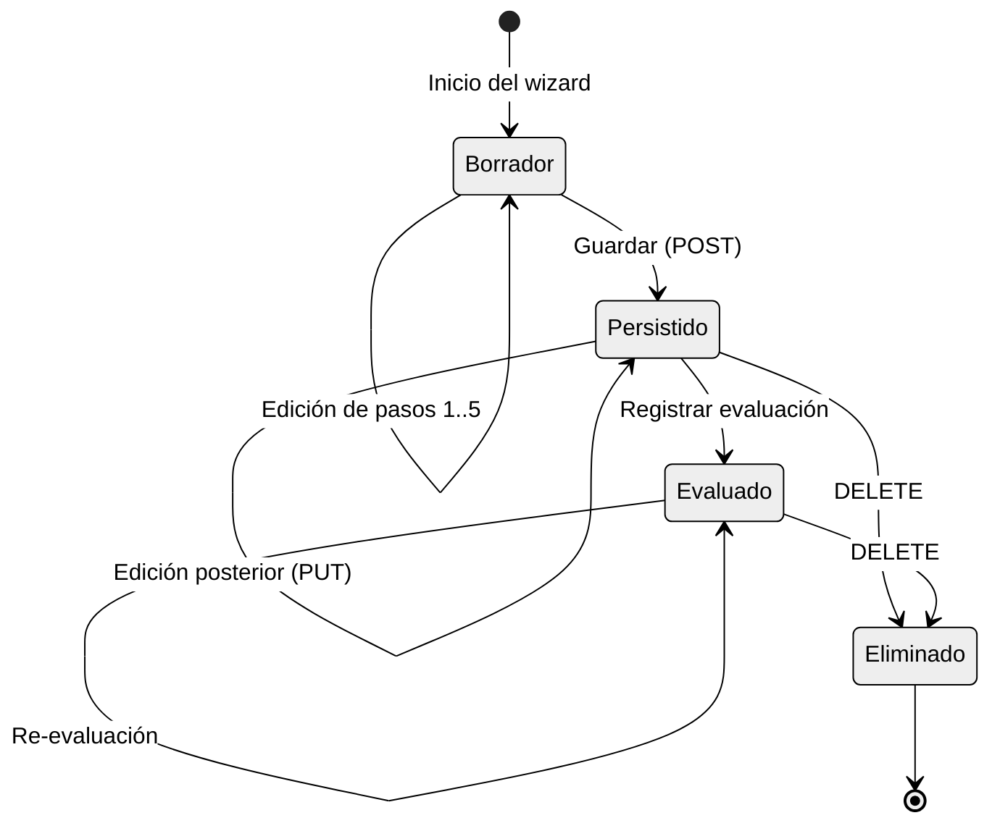

# 10. Diagramas de Actividad y Lógica del Sistema

## 10.1 Diagrama de Lógica General

Este diagrama representa la lógica global del sistema desde el ingreso del
usuario hasta la persistencia de la información.

## 10.2 Flujo del Asistente de Creación

## 10.3 Lógica de la Evaluación de Riesgo

## 10.4 Flujo de Despliegue en Railway

## 10.5 Diagrama de Estados de un Diagrama

