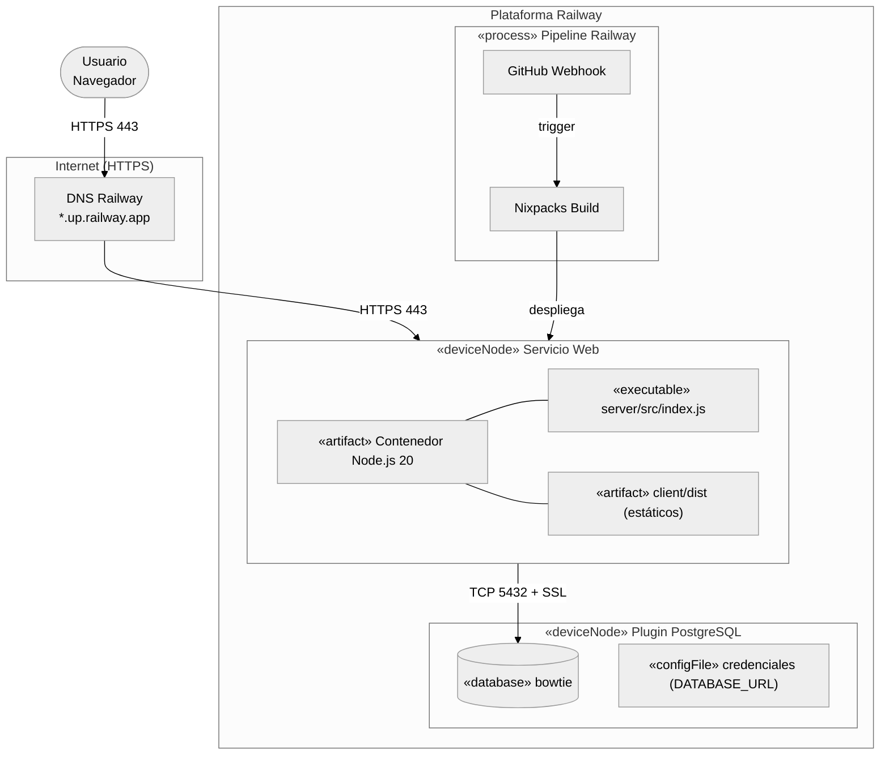

# 11. Diagrama de Despliegue

## 11.1 Topología de Despliegue en Railway

## 11.2 Especificación de Nodos

| Nodo | Tipo | Tecnología | Recursos típicos |
|------|------|-----------|-------------------|
| Servicio Web | Container Linux | Node.js 20 (Nixpacks) | 512 MB RAM / 1 vCPU |
| PostgreSQL | Add-on Railway | PostgreSQL 14 | Plan free / hobby |
| Build Pipeline | CI/CD interno | Nixpacks | — |

## 11.3 Variables de Entorno en Railway

| Variable | Origen | Descripción |
|----------|--------|-------------|
| `NODE_ENV` | Manual | Debe configurarse como `production`. |
| `PORT` | Railway | Inyectado automáticamente. |
| `DATABASE_URL` | Plugin PostgreSQL | Cadena de conexión completa. |
| `PGSSL` | Manual (opcional) | `false` para deshabilitar SSL. |

## 11.4 Procedimiento de Despliegue

1. Crear un proyecto vacío en Railway.
2. Conectar el repositorio `JuniorV17/bowtie` desde GitHub.
3. Agregar el plugin **PostgreSQL**. Esto generará `DATABASE_URL`.
4. Configurar la variable `NODE_ENV=production` en el servicio web.
5. Iniciar el primer despliegue. Railway detectará `railway.json` y `nixpacks.toml`.
6. Una vez desplegado, abrir una *console* del plugin PostgreSQL y ejecutar el contenido de `database/init.sql` para crear las tablas y datos de ejemplo.
7. Verificar que el endpoint `/api/health` responda con `200 OK`.

## 11.5 Estrategia de Salud

| Aspecto | Configuración |
|---------|---------------|
| Endpoint | `/api/health` |
| Timeout | 100 segundos (configurable en `railway.json`) |
| Política de reinicio | `ON_FAILURE`, máximo 10 reintentos. |
| Logs | Stdout/Stderr capturados por Railway. |
| Métricas | Panel de Railway: CPU, memoria, peticiones/s. |

## 11.6 Consideraciones de Seguridad en Producción

- TLS automático mediante el dominio `*.up.railway.app` o dominio personalizado.
- `DATABASE_URL` se inyecta sin exponerse en el repositorio.
- `cors` se mantiene abierto en esta versión académica; se recomienda restringirlo a dominios específicos en producción real.
- No se aceptan archivos cargados por el usuario, eliminando vectores de subida maliciosa.

## 11.7 Plan de Roll-back

| Escenario | Acción |
|-----------|--------|
| Falla la versión recién desplegada. | Railway permite *redeploy* desde un commit anterior con un solo clic. |
| Falla la base de datos. | Restauración desde *backup* automático del plugin (depende del plan). |
| Configuración incorrecta de variables. | Edición desde el panel y reinicio del servicio. |
